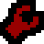

= Project Launcher

A development environment orchestrator that automatically detects your project type and sets up appropriate tmux sessions, environment variables, optional system services and other script based automations.

=== Supported Technologies

image:https://img.shields.io/badge/angular-DD0031?style=for-the-badge&logo=angular&logoColor=white[Angular]
image:https://img.shields.io/badge/astal-5190cf?style=for-the-badge&logo=astral&logoColor=white[Astal]
image:https://img.shields.io/badge/bun-282a36?style=for-the-badge&logo=bun&logoColor=fbf0df[Bun]
image:https://img.shields.io/badge/django-092E20?style=for-the-badge&logo=django&logoColor=green[Django]
image:https://img.shields.io/badge/elixir-4B275F?style=for-the-badge&logo=elixir&logoColor=white[Elixir]
image:https://img.shields.io/badge/fastapi-109989?style=for-the-badge&logo=fastapi&logoColor=white[FastAPI]
image:https://img.shields.io/badge/flask-%23000.svg?style=for-the-badge&logo=flask&logoColor=white[Flask]
image:https://img.shields.io/badge/flutter-02569B?style=for-the-badge&logo=flutter&logoColor=white[Flutter]
image:https://img.shields.io/badge/go-00ADD8?style=for-the-badge&logo=go&logoColor=white[Go]
image:https://img.shields.io/badge/html5-E34F26?style=for-the-badge&logo=html5&logoColor=white[HTML5]
image:https://img.shields.io/badge/next%20js-000000?style=for-the-badge&logo=nextdotjs&logoColor=white[NextJs]
image:https://img.shields.io/badge/node%20js-339933?style=for-the-badge&&logo=nodedotjs&logoColor=white[NodeJs]
image:https://img.shields.io/badge/python-FFD43B?style=for-the-badge&logo=python&logoColor=blue[Python]
image:https://img.shields.io/badge/uv-DE5FE9?style=for-the-badge&logo=uv&logoColor=white[uv]
image:https://img.shields.io/badge/Vite-B73BFE?style=for-the-badge&logo=vite&logoColor=FFD62E[Vite]
image:https://img.shields.io/badge/rust-black?style=for-the-badge&logo=rust&logoColor=#E57324[Rust]

.`*💡 What to Expect?*`
[%collapsible]
====
[discrete]
=== What to expect

|===
| Without run | With run

a| [source,bash]
----
> cd django-project
# Now.. what was that venv command?
> python -m venv venv
> source venv/bin/activate
# Phew almost done
> python manage.py runserver
# Error.. dependency not installed
> pip install -r requirements.txt
# Finally done
> python manage.py runserver
# Migration error dammit
> python manage.py migrate
# Open a new terminal
> nvim
# Now need to see output
> python manage.py runserver
# Open up browser and go to localhost:8000
# Done! Start working on the project.

# Finished development. Now for the next
# mono-repo project
> cd fastapi-project
> python -m venv venv
> source venv/bin/activate
> pip install -r requirements.txt
# What was the run command again?
> fastapi dev main.py
# Open up a new terminal
> cd nextjs-project
> npm install
> npm run dev
# Open up browser and go to localhost:3000
# Done! Wait.. features are not working
# Go to fastapi-project
# Debugging.. ahh found  new model changes
> ^C
# Look into README for migration command
> alembic upgrade head
# Ohh.. this project needs database server
> systemctl start postgresql
> fastapi dev main.py
# Finally time to develop new features.
> nvim
# Now what was I supposed to build?
----

a| [source,bash]
----
> cd django-project
> run
# You have some pending migrations
# Auto-applied migrations into database
# Here's the virtual environment,
# test cases, running server, code editor
# and the output opened up in browser.
# Start coding right away!
> ^c
# You have changes in tables: [table names]
# You might want to do this command:
# "suggested command"
# Good bye!

# Add a onetime mono-repo config
> cd nextjs-project
> run
# Start coding right away again!
----
|===
====

==  Installation

Clone the repository and run the install script:

[source,bash]
----
git clone "https://github.com/MidHunterX/Project-Launcher" --depth 1
cd Project-Launcher
bash ./install.sh
----

=== Requirements

- **Required**: `bash`, `systemctl` (for services)
- **Optional**: `tmux` (for session management)
- **Per-project**: Technology-specific tools (npm, pip, cargo, etc.)

==  Quick Start

Navigate to any project directory and run:

[source,bash]
----
run
----

The runner will:

1. Detect your project type automatically
2. Install dependencies if needed
3. Migrate database if any unapplied migrations are detected
4. Start required services
5. Create a tmux session with appropriate windows
6. Launch your development server
7. Run post-initialization commands if enabled
8. Open server URL (if any) in browser
9. Does a post validation and warns if models are left changed without creating migrations on exit

[NOTE]
If TMUX is not installed, the runner will just detect project, run the
appropriate server command and open server URL in browser.

==  Configuration Settings

Create a `.runrc` file in your project root and add following overrides for
project-specific customization. All settings are optional.

===  Per-Project Configuration

==== Minimal Configuration

The most minimal configuration is actually NO configuration at all. Everything is auto-detected.

But, if you are like me who don't want PostgreSQL running in the background all
the time and only wants it running when developing a specific project only
then, your minimal config for that project would just be:

[source,bash]
----
ENABLED_SERVICES=(
  postgresql
)
----

==== Full Configuration

[source,bash]
----
# ------------------------------------------------------------- PROJECT DETAILS

# Default: project dir name
PROJECT_NAME=""

# Default: automatic detection
# Available values:
# none, angular, gtk_astal, django, elixir, python_fastapi, python_flask,
# flutter, go, html, nextjs, nodejs, python, python_uv, reactjs,
# react_vite, rust
PROJECT_TYPE=""

# ------------------------------------------------------------- SYSTEM SERVICES

# Services: add any valid systemd service names here to start
ENABLED_SERVICES=(
  # postgresql
  # docker
  # nginx
)

# ------------------------------------------------------------ BROWSER SETTINGS

# Default: automatic detection
# Available values: none | {custom url}
URL=""

# Default: xdg-open
# Available values: {custom command, arguments and newtab flag at the end}
BROWSER=""

# --------------------------------------------------------- BEHAVIORAL SETTINGS

# Settings: [ true | false ]
AUTORUN_COMMANDS=true
----

===  Global Configuration

Just create `~/.config/run/config.conf` or `run/config.conf` in your XDG config path.

Example 1: Just Browser

[source,bash]
----
# custom browser, arguments and newtab flag at the end
BROWSER="firefox --new-tab"
----

Example 2: Custom Timezone + Browser

[source,bash]
----
BROWSER="TZ=Asia/Dubai firefox --new-tab"
----

Example 3: Window Manager + Custom Timezone + Custom Browser Profile

[source,bash]
----
BROWSER="hyprctl dispatch 'hl.dsp.focus({ workspace = 2 })' && TZ=Asia/Dubai firefox-developer-edition -P Personal --no-remote --new-tab"
----

The global configuration file sets default values for all projects.

==  Customization

=== Per-Project Logic Overriding

Use the following overrides in `.runrc` for more granular customization.

These can also be used to extend support for new technologies as well.

Add `#!/usr/bin/env bash` at the top of the file to make it play nice with LSP.

[source,bash]
----
# ------------------------------------------------------ OVERRIDE PROJECT SETUP

setup_env_custom() {
  # Project specific custom init setup example
  # Syntax: setup_base_env "env_directory" "command to init env_directory"
  setup_base_env "node_modules/" "npm install --force --legacy-peer-deps"
}

# -------------------------------------------------------- OVERRIDE TMUX LAYOUT

setup_layout_custom() {
  # Project specific custom layout example
  local current_dir=$(pwd)
  local api_dir="../example-fastapi-project"

  # 1. Server (FastAPI)
  cd "$api_dir"
  setup_env "python"
  create_window "API Server" "fastapi dev main.py"

  # 2. Server (NextJS)
  cd "$current_dir"
  setup_env "nextjs"
  create_window "Web Server" "npm run dev"

  # 3. Editor (FastAPI)
  cd "$api_dir"
  create_window "Editor (API)" "nvim"
  deactivate

  # 4. Editor (NextJS)
  cd "$current_dir"
  create_window "Editor (Web)" "nvim"
}

# ------------------------------------------------------- CUSTOM POST INIT HOOK

setup_post_init_hook() {
  # Project specific post execution hook example
  # Custom browser launch logic
  log "🔗 Launching browser..."
  (
    new_tab_url="http://localhost:3000"

    # Wait for the server to start
    local timeout=120
    while ! curl -sf "$new_tab_url" >/dev/null; do
      sleep 1
      ((timeout--)) || { exit 1; }
    done

    # Launch the browser
    firefox-developer-edition -P Personal --no-remote --new-tab $new_tab_url &
  ) &
}
----

=== Environment Variables

You can also add environment variables to `.runrc`

[source,bash]
----
export RUST_LOG=debug
----

=== Flutter + Hyprland Development

If you are using Flutter with Hyprland, you can do something like the following
to make development workflow much more nicer and app output stays out of your
way aesthetically.

[source,bash]
----
setup_post_init_hook() {
  log "📏 Resizing output window..."
  (
    local timeout=120
    while true; do
      sleep 1
      workspace_id=$(hyprctl -j activeworkspace | jq '.id')
      tiled_window_count=$(hyprctl -j clients | jq "[.[] | select(.workspace.id == $workspace_id and .floating == false and .pinned == false)] | length")
      # Check if the output window popped up
      if [ "$tiled_window_count" -eq 2 ]; then
        is_active_window_floating=$(hyprctl -j activewindow | jq -r '.floating')
        if [ "$is_active_window_floating" = "false" ]; then
          # Move app output to left
          hyprctl dispatch "hl.dsp.window.swap({ direction = 'l' })"
          # Make it smartphone like
          hyprctl dispatch "hl.dsp.window.resize({ x = -450, y = 0, relative = true })"
          # Since that is done, Select back the development window
          hyprctl dispatch "hl.dsp.focus({ direction = 'r' })"
          exit 0
        fi
      fi
      ((timeout--)) || { exit 1; }
    done
  ) &
}
----

=== Python Problems

A python project's requirements only works with an older python version due to
any of the dependencies not supporting newer python versions? Here's the
solution:

[source,bash]
----
setup_env_custom() {
  setup_python_env "venv" "python3.11 -m venv venv"
}
----

NOTE: `setup_python_env` is a special function specific to python. It allows
you to override commands only without changing the underlying logic for
applying environment. This function is used by `setup_env` under the hood.

=== Adding an Unknown Technology

If you want to add support for a new technology, you can support it by
following the per project overriding with `.runrc`:

* Setting up dependencies

[source,bash]
----
setup_env_custom() {
  # env_directory: is the directory which gets created after doing the init_command.
  # init_command: is the command you do to initialize the project. eg: npm install
  # eg: node_modules/ gets created after "npm install" -> setup_base_env "node_modules/" "npm install"
  #     venv/ gets created after "python -m venv venv" -> setup_base_env "venv/" "python -m venv venv"
  setup_base_env "env_directory/" "init_command"
  # add other dependency initialization commands here
}
----

* Setting up tmux layout

[source,bash]
----
setup_layout_custom() {
  create_window "Window 1" "command 1"
  create_window "Window 2" "command 2"
  create_window "Window 3" "command 3"
  # Add windows other here
}
----

==  Known Issues & Limitations

* No live lockfile tracking beyond initial check. If any dependencies change in repo while development, it has to be handled manually.

==  Q&A

Initial run without the Internet::
If there is a need to download dependencies and there is no internet available,
`run` will immediately stop with an error until there is an internet connection
to download the required dependencies. After that, it's perfectly fine to be
offline.

Running without any config::
If you are running `run` without any configuration, it will auto-detect all
config parameters. Root directory name is set as `PROJECT_NAME`. `PROJECT_TYPE`
is set based on the files or imports in the project. After detecting type, the
default url:port of framework is set as `URL`. xdg-open is set as `BROWSER`.

TMUX session detached instead of exiting::
`run` expects you to tackle one project at a time. So, after you finish, it
ends with a cleanup and postflight checks. If you detach the session instead,
the currently running services are elevated to highly important as other
sessions might need it. So, it will not be cleaned up by current and subsequent
sessions as well.

==  License

This runner is distributed under the link:LICENSE[MIT License].
